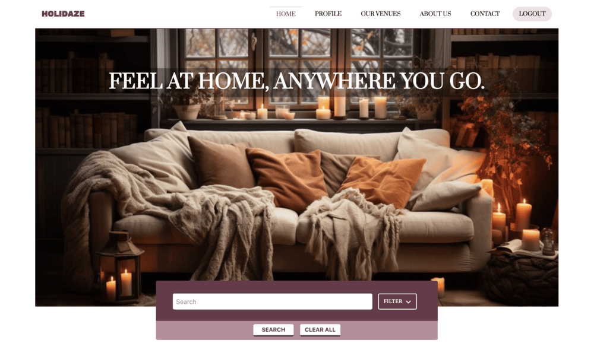

# Holidaze - Project Exam 2 - Noroff



This project is a holiday venue booking platform developed as part of the final exam for Front-End Development at Noroff.

## Description
### Goal
To take the skills learned over the last two years and take on an extensive project where the finished product should reflect the candidate’s general development capabilities, in addition to visual and technical skills.

### Brief
A newly launched accommodation booking site called Holidaze has approached you to develop a brand new front end for their application. While they have a list of required features, the design and user experience has not been specified. Working with the official API documentation, plan, design and build a modern front end accommodation booking application.

There are two aspects to this brief: the customer-facing side of the website where users can book holidays at a venue, and an admin-facing side of the website where users can register and manage venues and bookings at those venues.

User Stories
The client has specified the following requirements in the form of User Stories:

- A user may view a list of Venues
- A user may search for a specific Venue
- A user may view a specific Venue page by id
- A user may view a calendar with available dates for a Venue
- A user with a stud.noroff.no email may register as a customer
- A registered customer may create a booking at a Venue
- A registered customer may view their upcoming bookings
- A user with a stud.noroff.no email may register as a Venue manager
- A registered Venue manager may create a Venue
- A registered Venue manager may update a Venue they manage
- A registered Venue manager may delete a Venue they manage
- A registered Venue manager may view bookings for a Venue they manage
- A registered user may login
- A registered user may update their avatar
- A registered user may logout


# Required Links and Technologies

- **Gantt chart for project timing**: [Link to Gantt chart](https://www.notion.so/Project-Exam-2-173c10ec5f8c8065be1fe0e6af0b8281?pvs=4)
- **Design prototype**: [Link to design prototype](https://www.figma.com/design/XvtueR0wrxpul4148ovK21/Project-Exam-2)
- **Style guide**: [Link to style guide](https://www.figma.com/design/XvtueR0wrxpul4148ovK21/Project-Exam-2?node-id=1-5&t=nWxYrLquaaYo2jNp-1)
- **Kanban project board**: [Link to Kanban board](https://trello.com/invite/b/677be97e42da173e51c09d7f/ATTI2c298afbeabef50d93fbbe5f7eea5f4514C86F3D/project-exam-2)
- **Repository link**: [Link to repository](https://github.com/renahashimi/holidaze-pe2.git)
- **Hosted application demo link**: [Link to hosted app](https://holidaze-pe2-rh.netlify.app/)

**Technologies Used:**
- React
- Tailwind CSS
- Styled Components
- Prettier
- Vite
- ESLint

## Installation

1. **Clone the repository:**

   ```bash
   git clone https://github.com/renahashimi/holidaze-pe2.git
   ```
2. **Install the project dependencies:**

   ```bash
   npm install
   ```

3. **Run the development server:**

   ```bash
   npm run dev
   ```

4. **Open the app in your browser:**
   Visit [http://localhost:5173](http://localhost:5173) to view the app running locally.

## Development

To start the live development server, run the following command:

```bash
npm run dev
```

Runs the app in development mode using Vite.\
Open [http://localhost:5173](http://localhost:5173) to view it in your browser.

The page will reload when you make changes.\
You may also see any lint errors in the console.

## Build for Production

### `npm run build`

Builds the app for production to the `dist` folder.\
It correctly bundles React in production mode and optimizes the build for the best performance.

The build is minified, and the filenames include hashes.\
Your app is ready to be deployed.

## Live site - Netlify
[Holidaze](https://holidaze-pe2-rh.netlify.app/)

